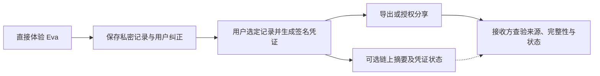

# Eva：Web2＋Web3 渐进式架构与实施边界

更新日期：2026-10-09。产品定位以 [Eva 项目简述](PROJECT-POSITIONING.md) 为准。

本文汇总当前项目讨论与源码审核，替代本文件此前以 RWA 生息金库、永久免费算力和公开性格指标为中心的早期架构。本文确立产品与架构方向；实施步骤仍是后续工作，不能据此宣称钱包、凭证或链上功能已经上线。源码审核基准更新为 `8f8f699`（2026-10-09）。本次只核对代码与配置；没有部署或验证 Base 链上交易。

## 1. 项目目标与架构选择

Eva 的终极目标是增强人类智能（IA）。当前产品通过情境互动，帮助用户理解思考模式，探索性格特质、人格底色与情绪性情，并允许用户补充与纠正观察。

Eva 采用 **Web2＋Web3 的混合架构，渐进式接入 Web3**，首阶段链已确定为 **Base**。日常互动、AI 理解与私密记录由应用和链下服务承载；用户需要导出、独立验证或授权分享时，启用凭证、可选钱包和必要的链上能力。Base Sepolia（chain ID 84532）用于开发与 Demo 验收；主网部署需另过安全、隐私和运行验收。

“Web2.5”可作为这种模式的简称，不是成熟度认证。选择依据是 Eva 的产品目标、私密记录需求和现有代码，而不是“唯一正确道路”的行业断言。面向没有钱包和已有钱包的用户都提供入口；具体登录方式和使用效果仍需真实用户验证。

钱包优先的 Web3 应用也可以使用链下 AI 与私密存储。是否采用去中心化计算，与是否在公链上执行推理是不同问题。Eva 当前不要求把钱包、签名或交易作为每次互动的前置条件。

## 2. 用户获得什么

- 直接进入情境体验，先获得自我探索价值。
- 保存并回看记录、依据与纠正历史；登录后继续积累。
- 按需要导出用户选定的记录及可验证签发信息。
- 自主指定接收方、内容、用途和期限，控制后续访问。
- 可选择钱包绑定及链上存证；链上凭证验证来源和内容完整性，不验证人格解读或心理结论的准确性。

体验设计应展示“保存到我的记录”“导出可验证记录”“授权分享”等明确动作。签名、公开字段和网络费用在确认时说明。后台代付可以减少操作，但不能替代用户授权；没有赞助预算时不承诺永久免费。

## 3. 职责划分

| 能力 | 应用及链下服务 | Web3／密码学能力 |
|---|---|---|
| 情境互动、报告呈现 | Next.js／React 提供交互，规则和 AI 提供受依据约束的观察 | 无需逐次上链 |
| AI 理解与用户纠正 | 根据获授权的相关记录理解表达、澄清疑点，保留观察版本与用户反馈 | 不把签名包装为科学准确性证明 |
| 私密内容 | 数据库及必要的加密存储，实施访问控制、用途限制和删除规则 | 原始对话、情绪、人际细节和完整画像不公开写入公链或公共 IPFS |
| 身份 | 独立用户 ID、邮箱登录，后续可增加 Passkey 与恢复机制 | 钱包作为可选绑定身份；地址不替代所有应用账户关系 |
| 记录凭证 | 确定内容范围、记录版本、签发格式、密钥管理和私密导出 | 用成熟签名实现公开可验证凭证；按需要锚定摘要和状态 |
| 授权分享 | 验证接收方身份，执行内容／用途／有效期检查，阻止撤回后的访问 | 按选定链验证用户授权签名；签名不自动执行数据访问限制 |
| 异步任务 | API 与独立 Worker、Redis／BullMQ 提供处理和恢复 | 链任务另需提交、确认、失败、重试及业务幂等 |

## 4. 对参考建议的校正

| 参考说法 | 当前采用的判断 |
|---|---|
| 纯 Web3 必然流失 99% 用户；接入仅需少于 5% 改动 | 没有可信测量支持这些比例，不作为项目事实或开发估算 |
| RLS 是严格物理隔离、Web2 保障绝对隐私 | RLS 是逻辑访问控制，不等于加密、物理隔离或用户自持；还需要角色、授权、存储和处理环节验证 |
| 所有 Web3 都公开所有数据 | 公链状态通常可被读取，但 Web3 应用可以采用链下私密存储，不能把两者混同 |
| 哈希是单向加密，外界绝对无法获知内容 | 哈希不是加密；短字段可被猜测，公开钱包与时间也可产生关联。需最小化公开字段，并使用适当随机化承诺及成熟实现 |
| 公链在物理上永远不能运行 AI | Eva 当前云端模型调用在链下执行。其他去中心化计算模式不是公链原生推理，不能据此断言整个行业的永久边界 |
| Passkey 等于 ERC-4337／无感钱包 | Passkey 是应用认证方式；ERC-4337 是 EVM 智能账户机制。绑定二者需要额外实现，Solana 不直接使用这些 EVM 标准 |
| 现有 scope 表与签名标准一比一对应 | 数据授权规则可以复用，还需独立身份、签名、有效期、重放防护和服务端执行 |
| 核心库可零成本迁移到任何环境 | 保持框架和链 SDK 独立有利于移植，具体运行环境仍需验证依赖、存储、网络和构建要求 |

本文不采用未经核实的全球钱包用户比例、固定延迟、链存储成本倍数或“所有行业标杆都如此”的结论，也不把个别产品示例作为 Eva 能力已经交付的证明。

## 5. 当前实现与已发现问题

以下是本次本地审核结果，不是线上验收报告。

| 项目 | 当前状态／证据 |
|---|---|
| 前端依赖 | `apps/web/package.json` 声明 Next.js 16／React 19；Bun 锁定 Next 16.3.8／React 19.3.0，本地 Web 子目录实际运行 Next 14.2.35／React 18.3.1。开发命令 `next dev --webpack` 实测报 unknown option 并退出 |
| 构建配置 | `apps/web/next.config.js` 有自定义 webpack，生产脚本为 `next build`。统一至 Next 16 后需明确 Webpack 或迁移 Turbopack，不能忽略别名配置 |
| 后端依赖 | NestJS core/common 为 10.4.22，testing 为 11.2.7，后者要求主版本 11。需要统一版本；不能仅凭版本数字判定全部测试失败 |
| 安装一致性 | 项目跟踪多个 Bun／npm 锁文件，`packageManager` 未固定 Bun 版本，需要确定唯一安装依据和 Node／Bun 运行版本 |
| 数据隔离 | 已有会话注入与 RLS 迁移；`scripts/verify-rls.mjs` 手写 WHERE 后判断隔离，并把匿名无条件读取到数据列为通过条件，不能证明数据库隔离正确 |
| 数据库角色 | `004_force_rls.sql` 关于 FORCE RLS 可约束 BYPASSRLS 的注释不成立。生产角色是否绕过隔离尚未验证，不据此声称发生数据泄露 |
| 授权与导出 | 有 grant／revoke／export 和用途范围检查；还未形成完整的外部接收方身份与委托访问产品闭环 |
| 钱包与凭证 | 已有 EIP-712 钱包挑战/绑定/解绑接口与 Ed25519 记录凭证签发、核验、撤销代码；本次未做运行或部署验收 |
| AI 主流程 | 游客与主题轮结果依答案规则生成；主题追问可条件调用模型。保存纠正还未接成完整的 AI 澄清和解释更新闭环 |
| Base 锚定 | 有 Base Sepolia 默认配置和凭证锚定 Worker 流程；`BaseService.submitCredentialAnchor` 当前返回基于摘要生成的占位哈希，没有调用合约发交易，默认合约地址为零地址 |
| 异步服务 | API 与 BullMQ Worker 分别运行；前端部署成功不证明后台任务可执行。后续需核验消费状态和真实任务恢复 |

## 6. 三种不同的证明

1. **游客认领 Token**：当前 `signGuestClaim` 使用 HMAC-SHA256，保护游客答案包和登录认领。它不是对外凭证，不把它简单改成用户钱包签名。
2. **Eva 签发的记录凭证**：证明选定记录的签发者、内容版本与完整性。使用公钥可验证的成熟签名格式，并处理签发密钥、轮换和凭证状态。
3. **用户授权**：表达用户允许哪个接收方、以什么用途、在什么期限内访问什么内容。授权签名不能替代签发者证明，也不免除后端权限检查。

签名凭证可以先在链下交付。链上模块在需要公开查验状态或存证时接入，而非强制为每轮互动发送交易。

凭证格式至少明确 schema/version、issuer/key identifier、记录版本、签发时间、所选内容摘要和状态引用。只包含用户选定内容；科学解释仍是可由用户质疑的观察。普通字段裁剪不宣称已实现零知识选择性披露。

## 7. 分阶段执行与验收

| 阶段 | 工作范围 | 验收结果 |
|---|---|---|
| 1. 工程基线 | 统一依赖安装与锁文件依据，处理 Web 子目录旧依赖，明确 Next 构建器，统一 Nest 主版本，固定运行版本 | 干净环境可安装、启动和构建；核心流程测试通过；本地与部署环境版本一致 |
| 2. 隐私与授权 | 最小权限应用角色与迁移角色分离；修正 RLS 验收；核查日志、AI 输入、导出和存储加密 | 隔离测试数据中匿名不可读，A 不可读写 B；撤回后新请求及待执行任务被阻止；线上角色另行核验 |
| 3. 可携带凭证 | 当前已有 Ed25519 签发、导出、离线核验与撤销代码；需验证密钥持久化/轮换、最小披露及接收方独立查验 | 独立环境可验签；篡改被拒绝，版本及失效状态可识别；凭证不冒充心理认证 |
| 4. 可选钱包 | 当前已有 Base EIP-712 挑战、签名校验、绑定/解绑代码；核对挑战原子消费、网络/域校验、钱包换绑与恢复 | 错误用户、过期及重放签名被拒绝；钱包变更不丢失应用记录；保留非钱包用户入口 |
| 5. Base Sepolia 真实链验证 | 部署并审阅最小锚定合约；以真实交易替换占位哈希；验证提交、收据、确认、失败恢复与幂等 | 浏览器可查真实交易；失败和重试状态准确；不泄露私密文本；主网前完成独立安全与密钥审查 |

第一版保持 Next.js／React＋NestJS＋PostgreSQL＋独立 Worker。核心库继续独立于链 SDK；Base 边界使用 EVM 工具（当前代码使用 Viem）。不接入多链抽象或 Solana 适配层，除非后续出现明确用户需求。

## 8. 隐私和用户控制的实际边界

- 对话和完整画像不公开上链；公共 IPFS 不是默认私密存储。
- 数据库访问控制、静态加密、模型处理权限、用户自持密钥各有作用，不能合称已实现端到端私密计算。
- 云端 AI 处理获授权文字时通常需要读取相关内容；应明确发送范围与模型供应商处理规则。
- 分享必须显示接收方、内容、用途和期限。用户可停止未来访问或使凭证失效；已被接收方下载的副本不能通过区块链远程收回。
- 链上历史通常不可由应用任意删除，钱包关联、时间和摘要也可能暴露关联线索，发布前应预览。
- 使用随机化承诺有助于避免短文本／分数猜测，不自动消除元数据关联，也不能省略完整验证方案。
- 当前选择 Base 作为首阶段目标链，不承诺完全去中心化或无条件数据主权。用户利益需通过可导出、可验证、可纠正和有效授权控制落实。Base 的选择不等于主网已部署或真实链上锚定已交付。

## 9. 第一版的产品闭环

**情境体验 → 本轮观察及依据 → 用户确认／反驳／补充 → 可选择的有限 AI 澄清 → 用户核对新解释 → 保存版本与历史 → 按需要导出或授权分享 → 可选链上凭证状态。**

AI 澄清属于待实施功能；当前观察与主题反馈已有基础。Web3 支持这条 IA 主链里的记录可信与控制能力。RWA、收益权、理财金库和代币方案不属于本版默认功能，不以保本、固定收益或永久免费算力作为产品承诺。

## 10. 官方依据与阅读入口

- [Next.js 16 升级说明](https://nextjs.org/docs/app/guides/upgrading/version-16)：默认构建器与自定义 webpack 配置。
- [PostgreSQL Row Security](https://www.postgresql.org/docs/current/ddl-rowsecurity.html)：角色、BYPASSRLS 与 FORCE 的边界。
- [FIDO Passkeys](https://fidoalliance.org/passkeys/)：应用认证、设备验证与跨设备使用。
- [EIP-712](https://eips.ethereum.org/EIPS/eip-712)：结构化签名，本身不提供重放保护。
- [ERC-4337](https://eips.ethereum.org/EIPS/eip-4337)：EVM 账户抽象，不等同于 Passkey。
- [W3C Verifiable Credentials 2.0](https://www.w3.org/TR/vc-data-model-2.0/)：签发者、持有者和验证者。
- [Base 文档](https://docs.base.org/)、[Base Sepolia 网络信息](https://docs.base.org/chain/network-information)：首阶段目标网络和开发依据，实施时重新核对官方网络参数。
- [Viem](https://viem.sh/)：当前 Base 钱包签名和网络读取代码所用 EVM 客户端库。
- [Eva 项目总纲：以 Web2 用户心智丝滑无痕接入 Web3 的最高指导原则](07-Eva项目总纲：以Web2用户心智丝滑无痕接入Web3的最高指导原则.md)：产品与交互层“去黑话、学信网式防伪、Passkey 零感知”最高执行准则。

历史方案见 [早期 MVP 探索](03-v1-mvp-spec.md)。该历史文档不覆盖本文的当前架构方向与实施边界。
