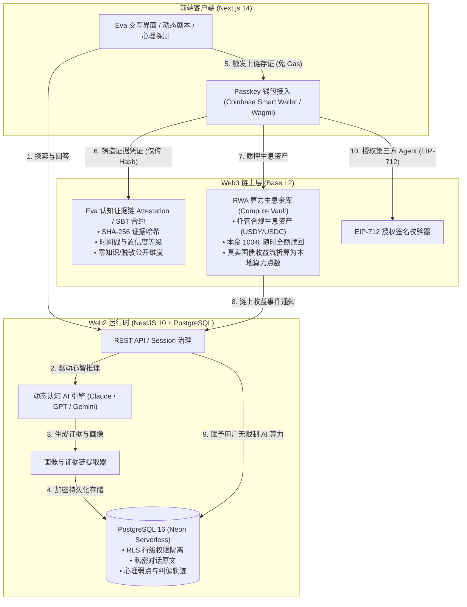

# Eva Web2 与 Web3 边界架构与系统设计

> **基本铁律**：Web2 负责心智计算与沉浸交互，Web3 负责资产收益与凭证主权。

---

## 1. 架构总览图



---

## 2. 职责划分矩阵与设计依据

| 模块 / 功能 | 部署端 | 设计依据与核心考量 |
| :--- | :--- | :--- |
| **交互 UI、音效、微动效** | **Web2 (Next.js)** | 必须实现 60fps 流畅交互与毫秒级即时响应，公链无法也不该承担渲染开销。 |
| **大模型推理与证据链推演** | **Web2 (NestJS/Workers)** | 认知评估依赖重度大模型多轮推理与动态分支算法，纯链上算力成本过高且无法对输入保密。 |
| **用户私密对话与完整画像** | **Web2 (PostgreSQL + RLS)** | **【隐私绝对红线】**：用户的深层心智纠偏、心理弱点、隐私原话绝不能以明文暴露在公链上，必须受 Postgres 行级安全策略严格保护。 |
| **认知状态防伪指纹 (Hash)** | **Web3 (Base SBT / EAS)** | **【反欺诈与真实性】**：链上只记录状态摘要哈希（Evidence Hash）和时间戳。哪怕 Eva 数据库被黑，链上哈希可用于比对证明历史真实性。 |
| **外部 Agent 调阅授权 (Consent)** | **Web3 (EIP-712)** | 用户通过私钥签名授予特定第三方读取某一子维度的权限，授权过程透明可追溯。 |
| **RWA 资产抵押与利息结算** | **Web3 (智能合约)** | **【资金主权与透明度】**：用户的理财本金直接与开源智能合约交互，平台无法挪用，本金随存随取，打消传统 Web2 充值卷款跑路的信任疑虑。 |

---

## 3. 隐私与数据安全铁律

1. **绝对禁止链上存储明文对话**：
   * 哪怕加密也不要上公链——因为未来的量子计算或私钥泄露可能导致几十年前的心智隐私被永久公开。
2. **凭证的结构化哈希规范**：
   * 链上 SBT 记录的数据结构为：
     ```solidity
     struct CognitiveAttestation {
         bytes32 evidenceRootHash; // sha256(全量证据链结构体 + 盐值)
         uint64 timestamp;        // 测评完成时间戳
         uint8 confidenceGrade;   // 置信度等级 (1-High, 2-Medium, 3-Low)
         uint16 coreDimensionBits; // 核心非敏感维度位掩码 (如: 创新型/保守型)
     }
     ```
3. **选择性披露（Selective Disclosure）**：
   * 当用户需要向招聘方或合作方证明某项特质时，由 Eva Web2 端根据 `evidenceRootHash` 导出带有零知识证明（ZKP）或 HMAC 签名的脱敏证明卡片，第三方验证该卡片哈希与 Base 链上哈希一致即可。
