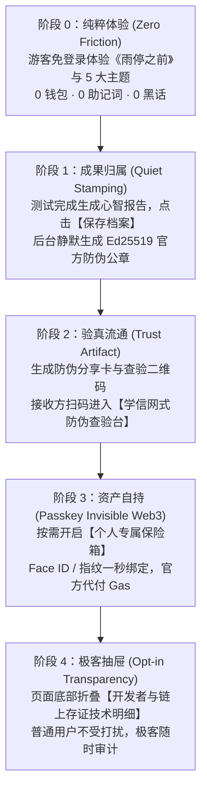

# 07. Eva 项目总纲：以 Web2 用户心智丝滑无痕接入 Web3 的最高指导原则

> **文档性质**：**Eva 项目最高级交互与产品哲学纲领（极其重要）**。
> **适用对象**：产品经理、前端开发、智能合约工程师、AI 算法工程师与测试人员。
> **核心使命**：杜绝“极客自嗨”与“密码学黑话堆砌”，以 Web2 真实用户的思维习惯与场景需求为中心，实现 Web3 能力的**“润物细无声、丝滑无痕（Frictionless & Invisible）”**接入。

---

## 一、核心立论：Web3 产品设计的最大误区——“把发动机抬到了驾驶舱”

### 1. 真实用户的痛点 vs 极客的傲慢

当一个普通人使用 Eva 时，他们想要的是：
1. **探索自我**：“我想通过互动游戏和情境选择，理解我遇到压力时为什么总想逃避或硬撑。”
2. **防伪可信**：“我想把我的抗压与复盘报告证明给求职猎头、合作方或恋人看，对方凭什么相信这不是我自己用 P 图软件改的？”
3. **数据主权**：“如果哪天 Eva 平台停运了，或者我换用 Claude / ChatGPT 作为我的私人 AI 助理，我能不能把我过去的心智记录无损带走，并且新 AI 能 100% 相信这些记录是真实的？”
4. **绝对私密**：“我最脆弱的内心想法和真实故事选项，绝对不能被任何外人、更不能被公开区块链偷窥。”

而当前大量 Web3 产品犯的致命错误是：**把后台底层的“齿轮、螺丝和发动机”，硬生生推到了普通用户的视线正中央！**
* 微信发消息时，没有人需要理解什么是 `RSA-2048 非对称密钥协商` 与 `TCP 三次握手`；
* 苹果 Apple Pay 刷卡时，没有人需要看 `Secure Enclave 硬件芯片与椭圆曲线加密证明`；
* 顺丰查快递时，没有人需要研究 `分布式 Raft 共识算法与时间戳服务器签名`。

**Eva 的第一铁律**：
> **Web3 与密码学必须退居幕后，充当沉默而可靠的“隐形守护者”；前台 100% 遵循普通用户的 Web2 心智直觉。用户享受的是“防伪公章”、“电子学历证书”式的信赖感，而不是被迫上一堂密码学与区块链公开课。**

---

## 二、去黑话（De-Jargonization）官方对照字典

在 Eva 所有面向终端用户的 UI 界面、按钮、提示与分享卡片中，**严禁主动出现晦涩的技术黑话**。所有技术概念必须无条件映射为普通人秒懂的通俗现实映射：

| 底层技术概念 (Web3/密码学) | 严禁在用户界面出现的黑话 | 官方标准通俗表达 (Web2 心智) | 现实生活中的心理映射 / 类比 |
| :--- | :--- | :--- | :--- |
| **Ed25519 平台数字签名** | `基于 Ed25519 签名平台凭证的独立离线验签` | **Eva 官方电子防伪公章 / 官方防伪认证** | 类似毕业证上的激光防伪标、体检报告上的医院公章 |
| **Verifiable Credential (VC)** | `W3C 可验证凭证 / JSON-LD Payload` | **受保护的官方心智档案 / 认证卡片** | 类似学信网电子认证报告、电子发票原件 |
| **Verify / Verification Portal** | `密码学验签门面 / 离线核验工具` | **心智档案真伪查验中心** | 类似学信网“学历在线查验”、中国电子发票真伪查验台 |
| **State Root Hash / Keccak256** | `状态根哈希 / Merkle Root` | **档案防伪指纹 / 唯一防伪码** | 类似防伪标签上的 16 位序列号、发票防伪码 |
| **Base Sepolia / Layer 2 Anchor** | `Base Sepolia 链上合约存证 / TX Hash` | **永久存证存根（官方时间戳备份）** | 类似公证处存证编号、档案馆永久归档时间戳 |
| **Passkey Smart Wallet / ERC-4337** | `智能合约钱包 / 账户抽象 / 助记词私钥` | **设备面容 / 指纹安全认证（无密码防盗）** | 类似 Apple ID 面容解锁、银行 App 指纹登录 |
| **Paymaster Gas Sponsorship** | `Paymaster 代付 Gas 费` | **平台免手续费支持（0 元免费防伪）** | 类似“顺丰包邮”、“平台补贴流量费” |
| **Selective Disclosure / 裁剪** | `零知识证明选择性披露 / Claim 裁剪` | **敏感对话保护（仅展示授权结论）** | 类似身份证打马赛克（只出示年龄，隐去家庭住址） |
| **Revoke** | `凭证 Revocation 状态变更` | **作废此记录 / 撤回外部查验授权** | 类似挂失银行卡、撤回已发送的分享权限 |

---

## 三、四大真实业务场景：普通用户为什么需要这些功能？

### 场景 1：求职与团队协作（防截图造假）
* **用户痛点**：小王在求职或晋升时，想向用人部门展示自己具备“高协作韧性”与“面对冲突时主动沟通、客观复盘”的思考特质。如果只是截图，HR 会怀疑是 PS 伪造的；如果给看聊天记录，又会暴露小王过去的敏感纠结与隐私。
* **无痕解法**：小王在 Eva 点击【分享官方防伪卡】，生成一张带有二维码的心智凭证。HR 微信扫码即打开查验中心：
  * 页面显示绿标：**“🏛️ Eva 官方真实认证：该记录由本人在 2026-10-09 亲自完成，未受篡改”**；
  * 页面显示隐私承诺：**“🔒 原始情境选项已加密隐蔽，当前仅展示用户授权的公开应对倾向”**；
  * HR 100% 相信真实性，小王隐私得到完好保护。

### 场景 2：跨 AI 智能体数据互通（数据便携与主权）
* **用户痛点**：小王用 Eva 积累了半年的心智模型，现在想换用 Claude 或 ChatGPT 作为全能生活管家，或者接入一家 AI 心理健康顾问。小王不想花三个月从头向新 AI 解释“我是个什么样的人”，更不想被 Eva 平台死死锁死。
* **无痕解法**：小王点击【导出我的心智档案】。导出的文件带有 Eva 官方防伪签名。新 AI 读取文件后，几毫秒内就能自主完成密码学校验，确认“这份档案确实是 Eva 官方签发，没有被小王手动修改过数值”，瞬间建立对小王的深度理解。

### 场景 3：亲密关系坦诚沟通（安全客观的镜像）
* **用户痛点**：在亲密关系中产生摩擦时，小王想解释“在激烈争执时我选择退后一步不是冷暴力，而是我需要缓冲空间”，但自己口头说容易被对方认为是狡辩。
* **无痕解法**：出示 Eva 模拟情境测试结果：“Eva 在《雨停之前》模拟情境中观察到我的应对策略是‘在情绪过载时优先拉开观察距离’，并且我本人已对此补充确认”。客观的第三方镜像与用户自述结合，成为人际理解的润滑剂。

### 场景 4：抗平台倒闭与防封号（终生心智资产自持）
* **用户痛点**：Web2 平台可能会下线、倒闭、或者误封账号。一旦账号封禁，用户积累多年的反思日记和心智成长曲线付之一炬。
* **无痕解法**：档案存根由用户借助 Base 链上时间戳固化。即使未来 Eva 官方服务器宕机，用户手中的档案凭证依然可以通过任何开源验证器离线验真，永久有效。

---

## 四、Web2 到 Web3 的“丝滑无痕五阶进化漏斗”

1. **阶段 0（沉浸体验）**：用户无需注册、无需连接钱包，直接体验情境测验，获取当下即时反馈。
2. **阶段 1（静默盖章）**：生成结果时，后端自动为数据打上时间戳并附加平台防伪签名（Ed25519），但界面上只叫“已妥善保存到你的心智档案”。
3. **阶段 2（验真流通）**：当用户分享时，对外呈现的是“学信网”式的真伪核验体验。查验页面突出“官方认证、未被篡改、隐私保护”，并提供“一键体验官方示例”，彻底抹平使用门槛。
4. **阶段 3（指纹/面容无感进阶）**：当用户需要跨平台导出或上链存证时，调起系统级 Passkey（Face ID / Touch ID），使用账户抽象（ERC-4337）完成智能账户创建，平台 Paymaster 赞助全部 Gas。**全程不出现“复制助记词、充值 ETH、设置 Gas Price”**。
5. **阶段 4（极客抽屉）**：链上交易哈希、EAS 载荷、原始 JSON 结构体一律放入底部的折叠面板（`
`），满足开发者和审计者，不干扰 99% 的普通用户。

---

## 五、前端开发与交互自查红线（PR 审核准则）

所有涉及 Web3、凭证与存证的前端页面必须严格遵守以下 5 条红线：
1. **禁止裸露技术名词**：页面中如果出现 `Ed25519`、`keccak256`、`EAS`、`SBT`、`Paymaster`、`RPC` 等词汇，且没有提供通俗业务解释或置于折叠技术明细中，**PR 一律不予合并**。
2. **必须提供示例体验**：任何需要用户输入文件或编码的查验/测试页面（如 `/verify`），必须提供【载入官方示例一键体验】按钮，不允许让普通用户面对空白输入框发呆。
3. **状态结果必须人性化**：验真成功显示“官方真实认证 · 内容未受篡改”，严禁仅显示冷冰冰的布尔值 `{ valid: true, digestMatch: true }`。
4. **隐私保护必须显性呈现**：每次出示凭证必须向用户和查验者明确标明：“敏感故事选项和原始对话受加密保护，未对外公开”。
5. **钱包操作必须极简**：钱包连接统一采用 Passkey 指纹/面容 ID 方式，默认代付 Gas，不强迫用户自备 Gas 代币。
